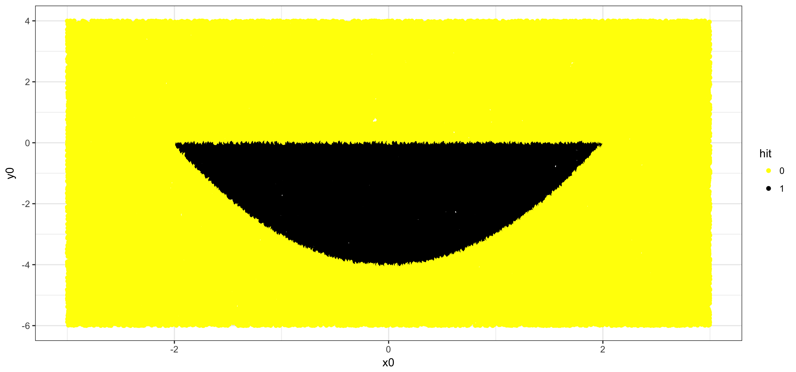

# A simple illustration of how Monte Carlo simulations can be applied

Problem: Calculate the area of the mouth of the smiley.

In this case the problem can be solved algebraically by integration, allowing us to compare the result of the MCS with the true value. The script outputs:

Area calculated by simulations = 10.7406
Actual area = 10.66667

I have made a version only using base R and a version, which uses Hadley Wickham's brilliant TidyVerse
